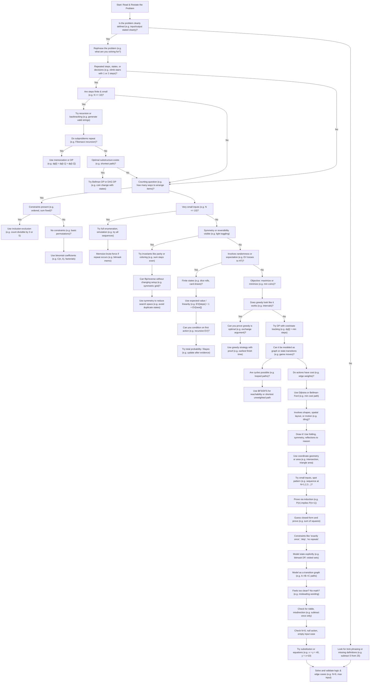

```mermaid

flowchart TD

  Start["Start: Read & Restate the Problem"]

  %% First sanity check
  WellDefined["Is the problem clearly defined (e.g. input/output stated clearly)?"]
  Rephrase["Rephrase the problem (e.g. what are you solving for?)"]
  LookForAmbiguity["Look for trick phrasing or missing definitions (e.g. subtract 5 from 25)"]

  %% 1: Structural Clue - Steps / Sequences / Moves
  HasSteps["Repeated steps, states, or decisions (e.g. climb stairs with 1 or 2 steps)?"]
  FiniteSteps["Are steps finite & small (e.g. N <= 10)?"]
  TryBacktrack["Try recursion or backtracking (e.g. generate valid strings)"]
  Overlapping["Do subproblems repeat (e.g. Fibonacci recursion)?"]
  UseDP["Use memoization or DP (e.g. dp[i] = dp[i-1] + dp[i-2])"]
  Substructure["Optimal substructure exists (e.g. shortest path)?"]
  Bellman["Try Bellman DP or DAG DP (e.g. coin change with states)"]

  %% 2: Counting-based
  CountQuestion["Counting question (e.g. how many ways to arrange items)?"]
  WithConstraints["Constraints present (e.g. ordered, sum fixed)?"]
  InclusionExclusion["Use inclusion-exclusion (e.g. count divisible by 3 or 5)"]
  NoConstraints["No constraints (e.g. basic permutations)?"]
  UseBinomial["Use binomial coefficients (e.g. C(n, k), factorials)"]

  %% 3: Small Inputs
  SmallInput["Very small inputs (e.g. N <= 10)?"]
  TryBrute["Try full enumeration, simulation (e.g. try all sequences)"]
  TryCache["Memoize brute-force if repeat occurs (e.g. bitmask memo)"]

  %% 4: Symmetry / Parity
  HasSymmetry["Symmetry or reversibility visible (e.g. light toggling)"]
  TryInvariance["Try invariants like parity or coloring (e.g. sum stays even)"]
  CanFlip["Can flip/reverse without changing setup (e.g. symmetric grid)?"]
  ReduceDomain["Use symmetry to reduce search space (e.g. avoid duplicate states)"]

  %% 5: Probabilistic
  ProbQuestion["Involves randomness or expectation (e.g. EV tosses to HT)?"]
  DiscreteStates["Finite states (e.g. dice rolls, card draws)?"]
  UseEV["Use expected value / linearity (e.g. EV[steps] = 1 + EV[next])"]
  Conditioned["Can you condition on first action (e.g. recursive EV)?"]
  UseBayes["Try total probability / Bayes (e.g. update after evidence)"]

  %% 6: Optimization
  OptGoal["Objective: maximize or minimize (e.g. min coins)?"]
  GreedyPossible["Does greedy look like it works (e.g. intervals)?"]
  GreedyProof["Can you prove greedy is optimal (e.g. exchange argument)?"]
  UseGreedy["Use greedy strategy with proof (e.g. earliest finish time)"]
  TryOptDP["Try DP with cost/state tracking (e.g. dp[i] = min steps)"]

  %% 7: State-Space / Reachability
  CanModelAsGraph["Can it be modeled as graph or state transitions (e.g. game moves)?"]
  CyclesPossible["Are cycles possible (e.g. looped paths)?"]
  UseBFSDFS["Use BFS/DFS for reachability or shortest unweighted path"]
  WeightedMoves["Do actions have cost (e.g. edge weights)?"]
  UseDijkstra["Use Dijkstra or Bellman-Ford (e.g. min cost path)"]

  %% 8: Geometry
  GeoPattern["Involves shapes, spatial layout, or motion (e.g. tiling)?"]
  CoordGeo["Use coordinate geometry or area (e.g. intersection, triangle area)"]
  TryDrawing["Draw it! Use folding, symmetry, reflections to reason"]

  %% 9: Pattern Detection
  PatternEmerges["Try small inputs, spot pattern (e.g. sequence at N=1,2,3…)?"]
  UseInduction["Prove via induction (e.g. P(n) implies P(n+1))"]
  GuessFormula["Guess closed-form and prove (e.g. sum of squares)"]

  %% 10: Constraints or Boolean
  WeirdConstraints["Constraints like 'exactly once', 'skip', 'no repeats'"]
  UseStates["Model state explicitly (e.g. bitmask DP, visited sets)"]
  TryTransitionGraph["Model as a transition graph (e.g. A->B->C paths)"]

  %% 11: Trickery
  FeelsOff["Feels too clean? No math? (e.g. misleading wording)"]
  CheckWords["Check for riddle, misdirection (e.g. subtract once only)"]
  TryZerothCase["Check N=0, null action, empty input case"]

  %% 12: Simple algebra
  UseAlgebra["Try substitution or equations (e.g. x + y = 40, y = x+10)"]

  Solve["Solve and validate logic & edge cases (e.g. N=0, max input)"]

  %% FLOW CONNECTIONS

  Start --> WellDefined
  WellDefined -->|Yes| Rephrase
  WellDefined -->|No| LookForAmbiguity --> Solve
  Rephrase --> HasSteps

  %% Step/Recursion/DP branch
  HasSteps -->|Yes| FiniteSteps
  FiniteSteps -->|Yes| TryBacktrack
  TryBacktrack --> Overlapping
  Overlapping -->|Yes| UseDP
  Overlapping -->|No| Substructure
  Substructure -->|Yes| Bellman
  Substructure -->|No| CountQuestion
  FiniteSteps -->|No| CountQuestion
  HasSteps -->|No| CountQuestion

  %% Counting branch
  CountQuestion -->|Yes| WithConstraints
  WithConstraints -->|Yes| InclusionExclusion
  WithConstraints -->|No| NoConstraints
  NoConstraints --> UseBinomial

  %% Small input
  CountQuestion --> SmallInput
  SmallInput -->|Yes| TryBrute --> TryCache
  SmallInput -->|No| HasSymmetry

  %% Symmetry
  HasSymmetry -->|Yes| TryInvariance
  HasSymmetry -->|No| ProbQuestion
  TryInvariance --> CanFlip --> ReduceDomain

  %% Probabilistic
  ProbQuestion -->|Yes| DiscreteStates
  DiscreteStates --> UseEV
  UseEV --> Conditioned --> UseBayes

  ProbQuestion -->|No| OptGoal
  OptGoal --> GreedyPossible
  GreedyPossible -->|Yes| GreedyProof --> UseGreedy
  GreedyPossible -->|No| TryOptDP

  %% Graph / state-space
  TryOptDP --> CanModelAsGraph
  CanModelAsGraph --> CyclesPossible --> UseBFSDFS
  CanModelAsGraph --> WeightedMoves --> UseDijkstra

  %% Geometry
  UseDijkstra --> GeoPattern
  GeoPattern --> TryDrawing --> CoordGeo

  %% Pattern Recognition
  CoordGeo --> PatternEmerges --> UseInduction --> GuessFormula

  %% Boolean / Constrainted
  GuessFormula --> WeirdConstraints --> UseStates --> TryTransitionGraph

  %% Trick question
  TryTransitionGraph --> FeelsOff --> CheckWords --> TryZerothCase

  %% Algebra fallback
  TryZerothCase --> UseAlgebra --> Solve


```